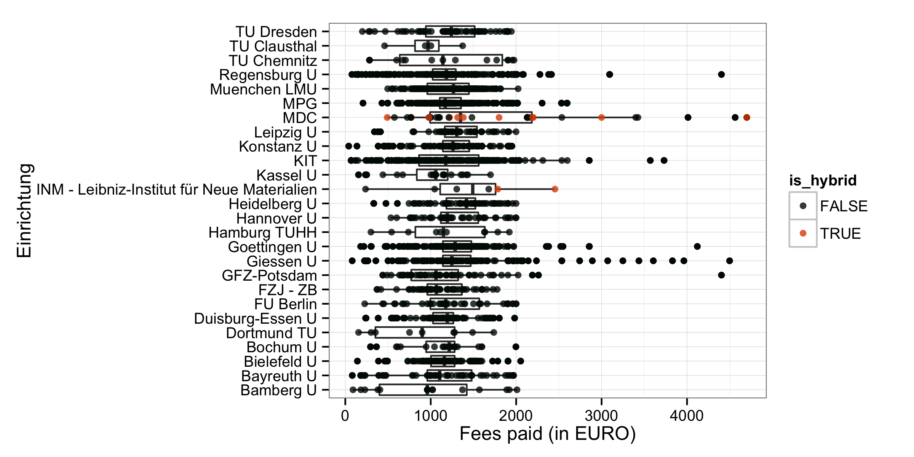

OpenAPC: Stand und Perspektiven
========================================================
author: Najko Jahn  
date: DINI AG EPUB Sitzung 28. Juli 2015

Agenda
========================================================

- Stand OpenAPC
- DFG Projekt INTACT
- Einbezug DINI AG EPUB

Stand OpenAPC
========================================================

Datenrepositorium:
<https://github.com/OpenAPC/openapc-de>

Wiki:
<https://github.com/OpenAPC/openapc-de/wiki/>

Blog informiert über Neuzugänge:
<https://openapc.github.io>

Emailliste:
<https://lists.uni-bielefeld.de/mailman2/cgi/unibi/listinfo/open-apc>

Dataset
==========================================================

Der Datensatz enthält Kosteninformationen sowohl für reine Open-Access-Veröffentlichungen als auch hybride Artikel.

- 26 Universitäten und AUF nehmen teil
- 4 309 121€ für  3 486 Artikel 
- Durchschnittsgebühr ist 1 236.1€ und der Median 1 201€.
- 521 Zeitschriftentitel aus 98 Verlagen.

======================================================

Coverage

======================================================

Coverage

======================================================

|Source     |variable  |description                     |
|:--------------|:---------|:-----------------------------------------------|
|CrossRef   |`publisher` |Title of Publisher             |
|CrossRef   |`journal_full_title` |Full Title of Journal  |
|CrossRef   |`issn` |International Standard Serial Numbers (collapsed) |
|CrossRef   |`issn_print` |ISSN print |
|CrossRef   |`issn_electronic`  |ISSN electronic        |
|CrossRef   |`license_ref`  |License of the article     |
|CrossRef   |`indexed_in_CrossRef`  |Is the article metadata registered with CrossRef? (logical)    |
|EuropePMC    |`pmid`  |PubMed ID                 |
|EuropePMC    |`pmcid` |PubMed Central ID         |
|Web of Science |`ut` |Web of Science record ID             |
|DOAJ           |`DOAJ` |Is the journal indexed in the DOAJ? (logical)    |

Zitierung und Versionierung
========================================================

Das GitHub-Repositorium wird einschließlich der Versionsgeschichte auf der GitLab-Instanz der UB Bielefeld synchronisiert und ist über eine DOI zitierbar.

Marco Tullney (TIB/UB Hannover) hat einen Vorschlag zur dynamischen Zitierung erarbeitet, das auf einem einheitlichen Releasemanagement beruht.

Dissemination
========================================================

Im Juni:

- [Workshop ELAG 2015]()
- [DFG-SUB-Workshop Publikationsfonds]()
- [LIBER 2015](http://de.slideshare.net/Dirk_Pieper/openapc-liber2015)

Im September / Oktober:

- [Open Access Tage (Marco Tullney)]()
- [DINI Jahrestagung]()

INTACT - Transparente Infrastruktur für Publikationsgebühren
========================================================

- DFG-Ausschreibung "Open Access Transformation"
- Projektpartner: UB Bielefeld, MPDL, Institute for Interdisciplinary Science Studies, Uni Bielefeld
- 2,5 Stellen, 100%, E13
- drei Workshops

Beabsichtigter Projektbeginn nach Einstellung der Mitarbeiterinnen und Mitarbeitern!

Ziel
========================================================

* Analyse des Open-Access-Publizierens in wissenschaftlichen Zeitschriften im Rahmen einer bibliometrischen Zeitreihenanalyse 
* die Etablierung eines nationalen Daten-Services für Open-Access-Publikationsgebühren zur Schaffung von Transparenz im Hinblick auf Preisinformationen und Finanzströme in Zusammenarbeit mit der DINI AG EPUB
* Ausbau der Initiative Efficiency and Standards for Article Charges (ESAC), in der in Kooperation mit Fachverlagen gemeinsam Geschäftsprozesse entwickelt werden

Einbezug DINI AG EPUB
========================================================

- Kontinuierliche Betreuung durch ProjektmitarbeiterIn (tba)
- Funktionale Anforderung Anreicherungs- und Berichtsprozess
- Austausch zwischen den Einrichtungen
- Internationale Vernetzung 

Vorschlag: Vertiefung und Abstimmung im Rahmen der nächsten Telko/Videokonferenz im September, Oktober.

